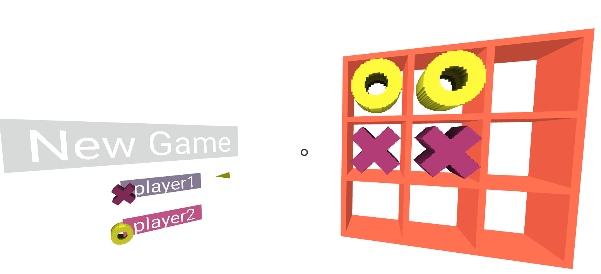
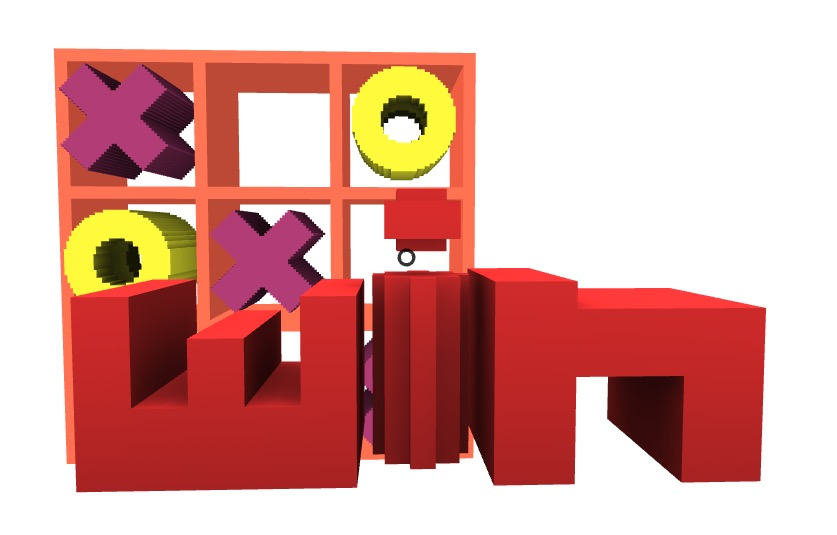
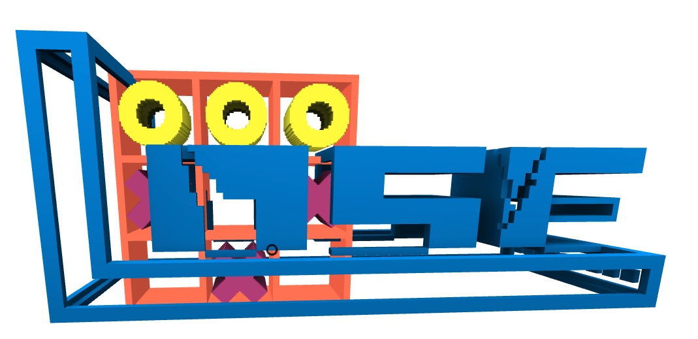
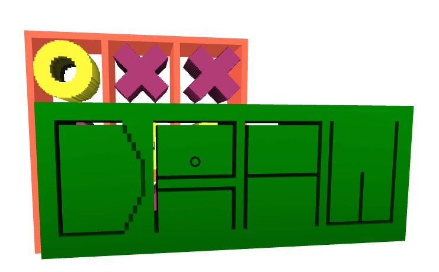

<h1 align="center"> VR Tic Tac Toe </h1>

<b>A VR game built by A-Frame</b>

     

  

---

## Try It
#### :point_right::point_right::point_right: [jinxjinx.github.io/vr-tic-tac-toe](https://jinxjinx.github.io/vr-tic-tac-toe)
---

## Screenshots

#### win

#### lose

#### draw

